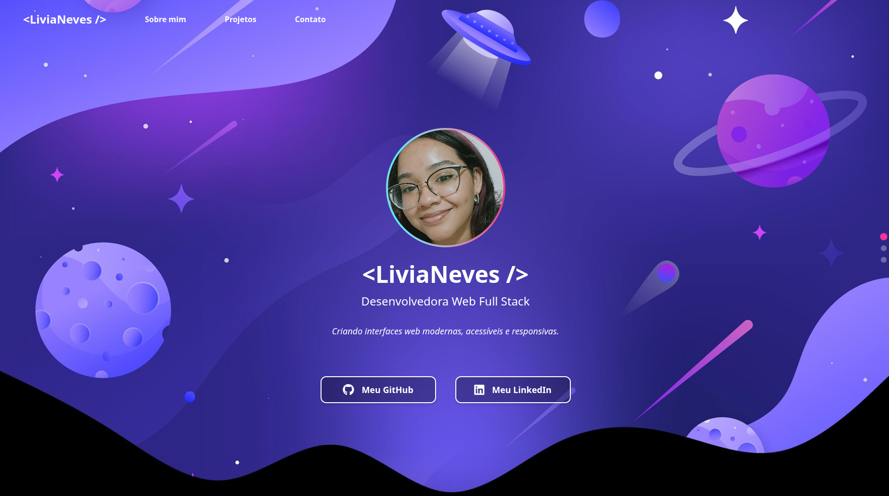

# 💫 Portfólio | Livia Neves

Bem-vindo(a) ao meu portfólio pessoal! ✨  
Este projeto foi desenvolvido com muito carinho para apresentar quem sou, minhas habilidades e meu trabalho como **Desenvolvedora Web Full Stack**.

## 📸 Preview

---

## 🛠️ Tecnologias Utilizadas

- [React.js](https://reactjs.org/)
- [Vite](https://vitejs.dev/) (para bundling rápido)
- [Tailwind CSS](https://tailwindcss.com/) (estilização moderna)

---

## ✨ Funcionalidades

- Navegação vertical com scroll suave
- Destaque da seção atual com pontos interativos
- Layout responsivo (mobile → desktop)
- Animações suaves com transições
- Componentização elegante e reutilizável